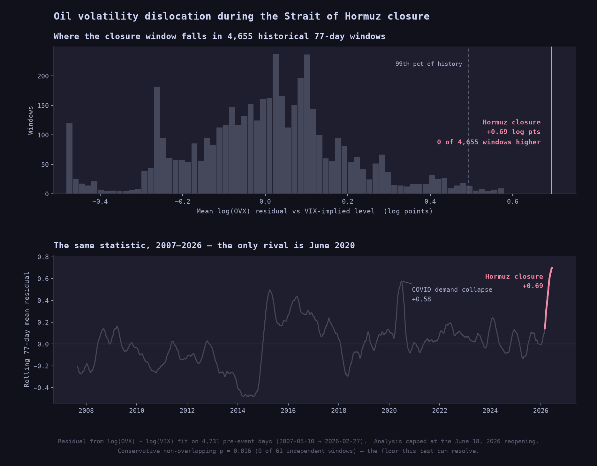
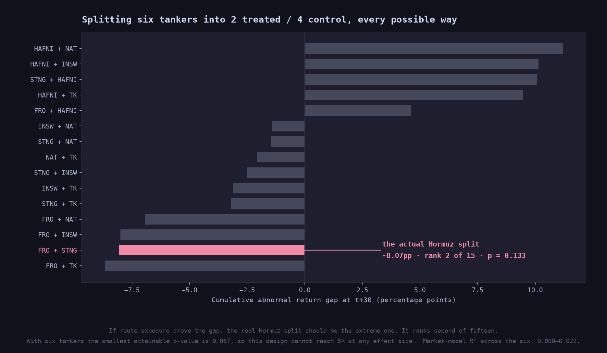

# HormuzWatch

**A closed study of the 2026 Strait of Hormuz closure. Ten analyses were run; one survived inference review. This README reports that one and documents why the other nine did not.**

> **Status: archived.** The Strait reopened on **June 18, 2026**, and every number here stops on that date. The live dashboard and its API have been retired — the site is now a static build that fetches no data at runtime (every figure is bundled; the world map is vendored; the only external request is the Google Fonts stylesheet), and the repository reproduces its own figures offline.
>
> **Static archive:** [aman12x.github.io/HormuzWatch](https://aman12x.github.io/HormuzWatch/)

---

## The reported finding

**During the closure, oil-implied volatility ran further above its equity-volatility-implied level than in any comparable window since OVX began in 2007.**



| | |
|---|---|
| Statistic | Mean residual from `log(OVX) ~ log(VIX)`, over the 77-trading-day event window |
| Observed | **+0.694 log points** (+38.60 vol points in the levels specification) |
| Historical windows at least as extreme | **0 of 4,655** |
| Percentile | 99.98 |
| Empirical *p*, overlapping windows | 0.0002 |
| Empirical *p*, non-overlapping (conservative) | **0.0161** — 0 of 61 independent windows |
| Nearest historical rival | June 2020, COVID demand collapse (+0.58 log pts) |

The conservative *p* of 0.0161 is the **floor this test can resolve**: with 61 independent windows, zero exceedances is the most extreme result obtainable. The finding is as strong as the design permits, and no stronger.

### Why the test is built this way

The obvious specification — regress OVX on VIX with a post-event dummy — was the original approach, and its reported *p*<0.0001 was not supportable. Residual Durbin-Watson is 0.240 (AR(1) ≈ 0.88), the effective sample size is ~10 of 156, and under AR(1)-corrected errors the coefficient collapses from +30.2 to **+2.4 with *p* = 0.51**. Newey-West fails to rescue it at any bandwidth from 4 to 60 lags, because the residual is near-integrated.

The fix is not a better standard error. It is a better null. Rather than asking *"is this coefficient far from zero under an assumed error process,"* the test asks:

> How unusual is a 77-day stretch of OVX running this far above its VIX-implied level, relative to **every other 77-day stretch since 2007**?

That null distribution is built from real data with the real persistence already in it, so it requires no assumption about the error process at all. It is the in-time placebo of the synthetic-control literature applied to a time series.

Specifics: the `log(OVX) ~ log(VIX)` relationship is fit on **4,731 pre-event days** (2007-05-10 → 2026-02-27, slope 0.672, R² 0.504) so the shock cannot bend the line it is later measured against. Both the log and levels specifications survive; the log specification is preferred because volatility indices scale multiplicatively.

### What this does **not** show

- **It does not isolate the chokepoint.** The war, OPEC responses, and other concurrent oil news are all inside the event window. This is a statement about magnitude and rarity, not mechanism.
- **It is not a price effect.** It concerns implied volatility, not the level of crude.
- **It is one event.** A 99.98th-percentile reading establishes that the episode was extreme, not that Hormuz specifically caused it.

Reproduce with `python scripts/ovx_placebo.py`.

---

## Exploratory — not reported as findings

These are kept in the repository because falsifying your own work is part of the record, not something to delete. **None of them is a result.** Each notebook carries a banner naming its specific failure.

| Analysis | Notebook | Why it is not reported |
|---|---|---|
| Synthetic control | `02` | **Failed its own placebo.** Primary spec returns a *negative* ATT (−$3.77/bbl) against a −$2.99 placebo, ratio 1.3×, and the notebook's own rule prints the warning. The donor pool puts **77.1% weight on Brent spot while the treated unit is Brent futures**. The later spec that produced the previously headlined +$7.73 has no placebo test, and 20.2% of its counterfactual is a Dubai series forward-filled flat from before treatment. |
| "Futures synthetic control" | `02` | Not a synthetic control. One donor, convexity pins the weight to 1.0 — it is the demeaned Brent–WTI spread. The code comment says so. |
| Spot–futures basis spread | `02` | Arithmetic: $7.73 − $1.27. Carries no independent information. |
| Difference-in-differences | `05` | 4 entities; cluster-robust SEs need ~30–50 clusters, and the HC3 "cross-check" is worse. Non-stationary outcome on a step dummy with no serial-correlation correction. Parallel-trends *test* is a failure to reject (*p*=0.47) read as confirmation. Treatment date is the strikes, not the closure. |
| Commodity placebo | `03` | Base-dated **after** the shock (Mar 2), so it discards the event. Raw gap is +2.3 index points; the headline +15.0 comes almost entirely from a seasonal adjustment estimated from one prior year. |
| Shipping route placebo | `01` | Best identification idea here — same war, same industry, differs only in route exposure. Exact permutation over all C(6,2)=15 route splits ranks the observed −8.07pp gap **2nd, *p*=0.133**. With six tankers the smallest attainable *p* is 0.067, so the design cannot reach 5%. Market models are empty (R² 0.000–0.022). |
| US vs EU defense event study | `01` | R² of 0.062–0.117 against the EU benchmark (≈0.000 against SPY) — the abnormal returns are mostly noise. No test statistic is computed on any CAR. **Additionally not reproducible from this repo:** EXS1.DE and the FX series were fetched live and never persisted. |
| Granger transmission chain | `06` | `min p` across five lag specifications, uncorrected. Bonferroni sends oil→fertilizer from 0.0949 to **0.47**. Tested on fertilizer-company *equity returns*, not fertilizer prices. Granger causality is predictive precedence, not causation. |
| Food cost burden | `06` | Assumes a flat counterfactual, i.e. attributes 100% of wheat's move to the war. Arithmetic, not an estimate. Was already labelled illustrative. |
| Geographic impact scores | `07` | A hand-assigned index with no identification strategy and no uncertainty. **Stored notebook outputs are stale** — produced against an earlier 29-country CSV; the committed 30-country CSV yields 6 countries at ≥7, not 8. |

### The falsification, drawn

The shipping route placebo is worth seeing rather than just reading, because it is the closest this project came to a clean natural experiment — and because the test that killed it is the same *kind* of test that validated the OVX finding.



If route exposure drove the gap, the true Hormuz/non-Hormuz split should sit at the extreme of its own permutation distribution. It ranks second of fifteen. Regenerate with `python scripts/make_falsification_chart.py`.

### On "six independent methods"

The original framing claimed convergent evidence from six independent methods. It does not hold. They run on the same three to six price series; the DiD and the commodity placebo use *identical* treatment and control baskets; the basis spread is a subtraction of two other estimates; the futures "synthetic control" is a spread. Convergent evidence requires independent identifying variation. One event differenced six ways is the same number reported six times.

---

## Corrections made in the August 2026 review

| Claim | Status |
|---|---|
| Shipping CAR gap of **−7.94pp** | **Removed.** Appeared in `README.md` and `metrics.js` only, and in no notebook output. The reproducible value is **−8.07pp** (`scripts/refit_core.py`), and it is not significant. |
| **"~410M in high-exposure zones"** | **Removed.** No population data exists anywhere in this repository, and no cell computes it. |
| **"8 countries scored 7+/10"** | **Corrected to 6**, from the committed `country_impact.csv`. |
| OVX premium **+30.2, p<0.0001** | **Superseded.** Collapses to +2.4, *p*=0.51 under AR(1) errors. Replaced by the in-time placebo. |
| Live dashboard + Claude news API | **Retired.** Frontend is a static build; the news archive is a frozen module with original source links. |
| Live-fetched OVX/VIX history | **Now cached** to `data/raw/` so the finding reproduces offline. |

---

## Repository

```
HormuzWatch/
├── scripts/
│   ├── ovx_placebo.py                # THE REPORTED FINDING — in-time placebo
│   ├── refit_core.py                 # refits that demoted OVX-levels and shipping
│   ├── make_placebo_chart.py         # headline chart
│   └── make_falsification_chart.py   # shipping permutation chart
├── notebooks/                  # exploratory; each carries a status banner
│   ├── 01_event_study.ipynb        04_volatility.ipynb
│   ├── 02_synthetic_control.ipynb  05_diff_in_diff.ipynb
│   ├── 03_commodity_placebo.ipynb  06_food_fertilizer.ipynb
│   └── 07_geo_impact.ipynb
├── data/
│   ├── processed/              # frozen CSVs, all capped at 2026-06-18
│   └── raw/ovx_vix_history.csv # 2007–2026 OVX/VIX, cached for reproducibility
├── pipelines/                  # original ingestion (yfinance, FRED, IMF)
├── outputs/charts/             # all figures
├── hormuzwatch-ui/             # static React archive → GitHub Pages
└── tests/                      # cutoff enforcement
```

## Reproducing

Requires Python 3.12+ and [uv](https://github.com/astral-sh/uv).

```bash
uv venv .venv --python 3.12
uv pip install --python .venv/bin/python -r requirements.txt

.venv/bin/python scripts/ovx_placebo.py       # the reported finding
.venv/bin/python scripts/refit_core.py        # the two demotions, with verdicts
.venv/bin/python scripts/make_placebo_chart.py
.venv/bin/python scripts/make_falsification_chart.py
.venv/bin/python -m pytest tests/ -q          # cutoff enforcement
```

The frontend is static — no API, no keys:

```bash
cd hormuzwatch-ui && npm ci && npm run dev
```

## Data sources

| Source | Series |
|---|---|
| Yahoo Finance | `^OVX`, `^VIX`, `^GVZ`, `^MOVE`; BZ=F, CL=F; LMT, RTX, NOC, XOM, CVX, BP, FRO, STNG, SPY; CF, MOS, NTR; ZW=F, ZC=F, ZS=F |
| FRED (EIA) | `DCOILBRENTEU`, `DCOILWTICO`, `DHHNGSP` |
| FRED (IMF) | `POILDUBUSDM` — Dubai crude, monthly; **ends before treatment**, see notebook 02 |

## Timeline

| Date | Event |
|---|---|
| 2026-02-28 | US–Israel strikes begin |
| 2026-03-07 | Strait of Hormuz closed |
| 2026-06-18 | Strait reopens — **analysis window ends** |
